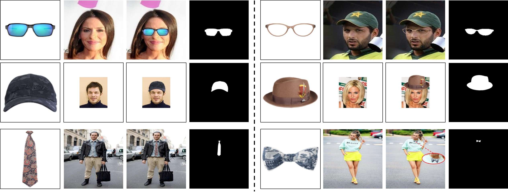

# Accessory-Try-On-Dataset-STRAT

This is the dataset used in the following research paper:

> Spatial Transformation for Image Composition via Correspondence Learning [[arXiv]](https://arxiv.org/pdf/2207.02398.pdf)
>
> Bo Zhang, Yue Liu, Kaixin Lu, Li Niu, Liqing Zhang

Our STRAT dataset contains three subdatasets: STRAT-glasses, STRAT-hat, and STRAT-tie, which correspond to ``glasses try-on", ``hat try-on", and ``tie try-on" respectively. By treating accessory image (*resp.*, human face or portrait image) as foreground (*resp.*, background), we ask human annotators to paste the foreground on the background and adjust four vertices of foreground to generate a realistic composite image. After adjustment, the coordinates of four vertices are recorded. In each subdataset, the training set has **2000** pairs of foregrounds and backgrounds, while the test set has **1000** pairs of foregrounds and backgrounds. Some examples of foreground, background, and annotated composite image with composite foreground mask from three subdatasets are show in the figure below.

In the ``trans_params.json``, we record both the vertice coordinates and warpping parameters of the foreground for each pairwise sample. Specifically, ``init_vertex`` represents the four vertices of the accessory in foreground image, and ``final_vertex`` means the four vertices of the warped accessory in composite image. Given pairwise ``init_vertex`` and ``final_vertex``, the transformation matrix (``trans_matri``) can be derived by calling ``findHomography`` function of OpenCV library. To facilitate verification of the warpping parameters we provide or your own predicted parameters, we shared python scripts ``composite_by_opencv.py`` and ``composite_by_pytorch.py`` in this repository, which implement vertex transformation and composite image generation based on transformation matrix using opencv and pytorch, respectively.     

The STRAT dataset is provided in [[Baidu Cloud]](https://pan.baidu.com/s/13J7jyxexNausxwEvVgaAfg) (access code: bcmi) or [[Google Drive]](https://drive.google.com/file/d/1vHN1vvg2JQZKRfqrYfQjyuJNvgkP9-gY/view?usp=sharing), in which we also provide the results of face/human parsing in ``background_mask`` and ``background_mask_comp`` folders.
